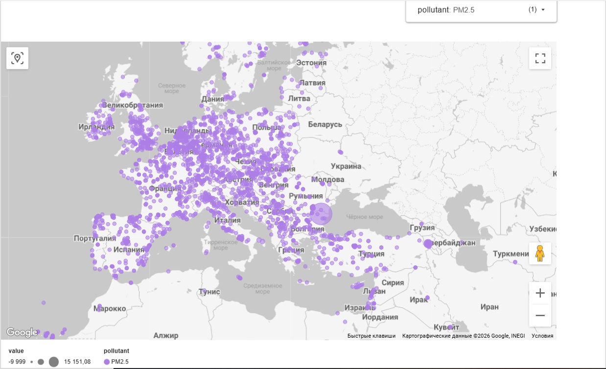
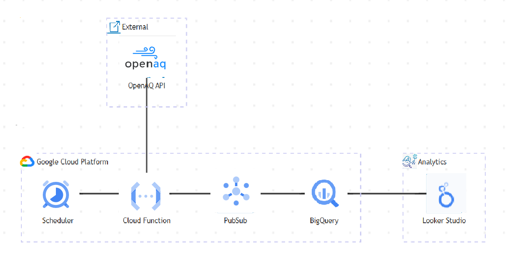

🌍 OpenAQ Global Air Quality Pipeline
An automated end-to-end data pipeline designed to collect, store, and analyze global air quality data using the OpenAQ API v3 and Google Cloud Platform (GCP) infrastructure.

🏗 System Architecture
The project follows the DWH Star Schema principle, ensuring high performance for analytical queries and efficient historical data storage.

Ingestion: Hybrid approach using Python scripts for Initial Load and Cloud Functions (Gen2) for Incremental Sync.

Transport: Google Cloud Pub/Sub for real-time, asynchronous data streaming.

Storage: Google BigQuery (Data Warehouse):

measurements_fact: Fact table partitioned by day for cost-optimization.

locations_dim: Dimension table containing station metadata (coordinates, country, and reverse-geocoded city names).

parameters_dim: Dimension table for pollutants (PM2.5, CO, NO₂, etc.) and their units.

Transformation: BigQuery Views (v_latest_measurements & v_history_measurements) utilizing ROW_NUMBER() for automated deduplication and real-time filtering.

Orchestration: Cloud Scheduler triggering synchronization every 10 minutes.

IaC: Entire infrastructure defined and deployed via Terraform.

🛠 Tech Stack
Infrastructure: Terraform (Infrastructure as Code)

Cloud (GCP): BigQuery, Pub/Sub, Cloud Functions Gen2, Cloud Scheduler, Cloud Storage

Data Processing: Python 3.11, Geopy (Reverse Geocoding)

Analytics: Looker Studio

🚀 Quick Start
1. Prerequisites
Terraform installed.

A Google Cloud Project with billing enabled.

An API Key from OpenAQ.

GCP Service Account credentials saved as terraform/keys.json.

2. Infrastructure Setup
Clone the repository.

Create a terraform/terraform.tfvars file:

Terraform
openaq_api_key = "YOUR_OPENAQ_API_KEY"
Deploy the infrastructure:

Bash
cd terraform
terraform init
terraform apply
3. Data Population
To initialize the system, run the following scripts in order:

Sync Locations (with Reverse Geocoding):

Bash
python src/sync_locations.py
Populate Parameters Dictionary: Execute the SQL script located in sql/setup_parameters.sql within the BigQuery console.

Initial Fact Load:

Bash
python src/initial_load_facts.py
📊 Analytics & Visualization
The data is visualized through a Looker Studio Dashboard connected directly to BigQuery:

Live Map: A bubble map with color-coded indicators representing real-time pollution levels across the globe.

Time-Series Analysis: 7 independent interactive charts tracking the dynamics of CO, NO₂, PM2.5, and other pollutants over the last 28 days.

    